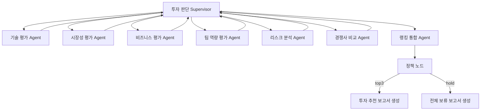
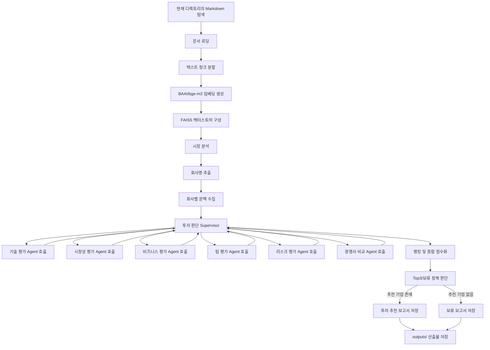

# Mermaid Architecture

## Agent Pattern

```mermaid
flowchart TD
    A["투자 판단 Supervisor"] --> B["기술 평가 Agent"]
    A --> C["시장성 평가 Agent"]
    A --> D["비즈니스 평가 Agent"]
    A --> E["팀 역량 평가 Agent"]
    A --> F["리스크 분석 Agent"]
    A --> G["경쟁사 비교 Agent"]
    B --> A
    C --> A
    D --> A
    E --> A
    F --> A
    G --> A
    A --> H["랭킹 통합 Agent"]
    H --> I["정책 노드"]
    I -->|"top3"| J["투자 추천 보고서 생성"]
    I -->|"hold"| K["전체 보류 보고서 생성"]
```

## Service Flow

```mermaid
flowchart TD
    A["현재 디렉토리의 Markdown 탐색"] --> B["문서 로딩"]
    B --> C["텍스트 청크 분할"]
    C --> D["BAAI/bge-m3 임베딩 생성"]
    D --> E["FAISS 벡터스토어 구성"]
    E --> F["시장 분석"]
    F --> G["회사명 추출"]
    G --> H["회사별 문맥 수집"]
    H --> I["투자 판단 Supervisor"]
    I --> J["기술 평가 Agent 호출"]
    J --> I
    I --> K["시장성 평가 Agent 호출"]
    K --> I
    I --> L["비즈니스 평가 Agent 호출"]
    L --> I
    I --> M["팀 평가 Agent 호출"]
    M --> I
    I --> N["리스크 평가 Agent 호출"]
    N --> I
    I --> O["경쟁사 비교 Agent 호출"]
    O --> I
    I --> P["랭킹 및 종합 점수화"]
    P --> Q["Top3/보류 정책 판단"]
    Q -->|"추천 기업 존재"| R["투자 추천 보고서 저장"]
    Q -->|"추천 기업 없음"| S["보류 보고서 저장"]
    R --> T["outputs/ 산출물 저장"]
    S --> T
```
