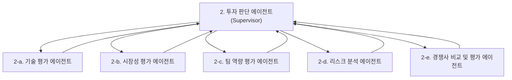
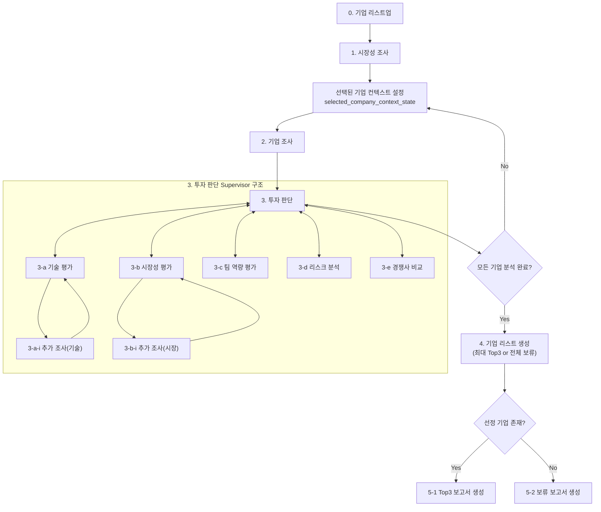

# prompt_project_summary_ai_ready

이 문서는 `/Users/angj/Downloads/prompt_project_summury.pdf`의 내용을 Markdown으로 재구성한 버전입니다.

- 원칙: PDF의 내용을 누락 없이 반영
- 원칙: 의미를 바꾸는 요약/삭제/재해석 없음
- 편집 범위: Markdown 구조화, 단계 분리, 표/코드블록 정리, 줄바꿈 보정

## 0. 코딩 진행 순서

아래 순서는 PDF 원문의 구조를 그대로 따라, 실제 구현을 step by step으로 진행할 수 있게 재배치한 것입니다.

1. `A. Domain 선정`
2. `B-1. Agent 설계`
3. `Agent(입력, 출력 state)`
4. `state 설명`
5. `B-2. Embedding Model`
6. `C. 투자 판단 기준`
7. `D. 그래프 설계`
8. `E. 투자 보고서`

---

## 1. A. Domain 선정

GPT 맥일거

A. Domain 선정

AI Semiconductor(AI 반도체)

---

## 2. B-1. Agent 설계

### 2.1 Agent(역할 설명)

| 순서 | Agents | 역할 |
| --- | --- | --- |
| 0 | 기업 리스트업 | 분석 대상이 될 후보 기업들을 코드 내의 리스트(10개의 기업)에서 수집하고 1차 풀(pool)을 구성한다. |
| 1 | 시장성 조사 | 전체 도메인 및 시장 환경을 조사한다. 시장 규모, 성장률, 고객 수요, 산업 트렌드, 규제/정책 흐름 등을 파악해 이후 기업 평가의 기준 맥락을 제공한다. |
| 2 | 기업 조사 | 개별 기업에 대한 기초 정보를 수집·정리한다. 제품/기술, 자사 기술에 대한 특허, 기술적 해자(Moat), 비즈니스 모델, 고객군, 매출/성과, 팀 구성, 경쟁 환경, 리스크 관련 정보를 조사하여 투자 판단 단계의 입력 데이터로 만든다. |
| 3-a | 기술 평가 | 해당 기업의 기술력과 제품 경쟁력을 평가한다. 기술 차별성, 구현 완성도, 확장성, 진입장벽, 기술 실현 가능성 등을 정성적 평가를 통해 점수화한다. |
| 3-a-i | 추가 조사(기술) | 기술 평가 과정에서 정보가 부족하거나 불확실한 부분을 보완 조사한다. 핵심 기술 스택, 특허, 성능 검증, 기술 적용 사례 등을 추가 확인하여 기술 평가 정확도를 높인다. |
| 3-b | 시장성 평가 | 기업이 속한 세부 시장에서의 성장 가능성을 평가한다. 시장 크기, 고객 문제의 심각성(고객이 지금 겪는 문제가 얼마나 크고, 불편하고, 자주 발생하고, 돈을 써서라도 해결하고 싶을 만큼 중요한가), 구매 가능성, 시장 진입 타이밍, 확장 가능성 등을 기준으로 정성적 평가를 통해 점수화한다. |
| 3-b-i | 추가 조사(시장) | 시장성 평가에 필요한 부족한 정보를 추가 수집한다. 고객군 특성, 경쟁 강도, 시장 침투 가능성, 수요 검증 자료 등을 보완해 시장성 판단의 신뢰도를 높인다. |
| 3-c | 팀 역량 평가 | 창업자 및 핵심 팀의 실행력을 평가한다. 도메인 관련 경험, 전문성, 조직 구성의 적절성, 사업 추진력, 문제 해결력, 도메인 이해도 등을 분석해 정성적 평가를 통해 점수화한다. |
| 3-d | 리스크 분석 | 투자 관점에서 주요 리스크를 식별하고 평가한다. 기술 리스크, 시장 리스크, 규제 리스크, 운영 리스크, 재무 리스크 등을 정리하고 위험 수준을 정성적 평가를 통해 점수화한다. |
| 3-e | 경쟁사 비교 | 유사 기업 및 대체재와 비교하여 상대적 경쟁력을 평가한다. 차별화 포인트, 가격/기술/시장 포지션, 경쟁 우위와 열위를 분석해 정성적 평가를 통해 점수화한다. |
| 3 | 투자 판단 | 3-a~3-e의 평가 결과를 종합해 기업별 투자 판단을 한다. 세부 점수, 종합 점수, 투자 의견, 강점/약점, 기술 요약, 시장성 평가 요약, 팀 역량 평가 요약, 경쟁사 비교 요약, 핵심 리스크 요약, 5가지 평가 요소를 기반으로 한 최종 요약 등을 정형화된 형태로 저장한다. |
| 4 | 기업 리스트 생성(최대 Top3 or 전체 보류) | 전체 기업의 투자 판단 결과를 모아 정책 로직을 적용한다. 기준 점수 이상 기업을 필터링하고, 상위 3개(기준점수 70점을 넘는 기업이 1개 혹은 2개인 경우도 포함)를 선정해 5-1로 분기할 수 있도록 하고, 통과 기업이 없으면 5-2로 분기할 수 있도록 한다. |
| 5-1 | Top3 보고서 생성 | 선정된 상위 기업들에 대해 투자 추천 보고서를 작성한다. 아래의 보고서 양식에 맞는 투자 보고서를 생성한다. |
| 5-2 | 보류 보고서 생성 | 기준 점수를 넘는 기업이 없거나 투자 보류가 필요한 경우 아래의 보고서 양식에 맞는 투자 보류 보고서를 작성한다. |

### 2.2 5-1 보고서 양식

1. SUMMARY
2. 평가 기준 및 방법론
3. 스타트업 별 투자 분석 요약
4. 기업 개요
5. 비즈니스 모델 및 사업화 현황
6. 평가 항목 별 점수 및 요약
7. 평가 기준 및 방법론
8. 기술력 평가
9. 시장성 평가
10. 팀 역량 평가 (팀 구성, 핵심 창업자, 기술 역량 등)
11. 경쟁사 분석 및 평가
12. 리스크 분석 (시장, 기술, 규제, 경쟁 등)
13. 결론
14. REFERENCE

### 2.3 5-2 보고서 양식

1. SUMMARY
2. 평가 기준 및 방법론
3. 스타트업 별 투자 분석 요약
4. 기업 개요
5. 평가 항목 별 점수 및 요약
6. 결론
7. REFERENCE

---

## 3. Agent(입력, 출력 state)

| 순서 | Agents | 입력되는 state | 출력되는 state |
| --- | --- | --- | --- |
| 0 | 기업 리스트업 | pipeline_meta_state, domain_definition_state = semiconductor(default) | candidate_company_pool_state |
| 1 | 시장성 조사 | pipeline_meta_state, domain_definition_state | domain_market_research_state |
| 2 | 기업 조사 | pipeline_meta_state, candidate_company_pool_state, selected_company_context_state | company_research_state |
| 3-a | 기술 평가 | company_research_state, domain_market_research_state, technical_additional_research_state(선택) | technical_evaluation_state |
| 3-a-i | 추가 조사(기술) | company_research_state, technical_evaluation_state | technical_additional_research_state |
| 3-b | 시장성 평가 | company_research_state, domain_market_research_state, market_additional_research_state(선택) | market_evaluation_state |
| 3-b-i | 추가 조사(시장) | company_research_state, domain_market_research_state | market_additional_research_state |
| 3-c | 팀 역량 평가 | company_research_state | team_evaluation_state |
| 3-d | 리스크 분석 | company_research_state | risk_analysis_state |
| 3-e | 경쟁사 비교 | company_research_state, domain_market_research_state | competition_evaluation_state |
| 3 | 투자 판단 | company_research_state, technical_evaluation_state, market_evaluation_state, team_evaluation_state, risk_analysis_state, competition_evaluation_state | investment_decision_state |
| 4 | 기업 리스트 생성(최대 Top3 or 전체 보류) | investment_decision_state[] | ranking_selection_state |
| 5-1 | Top3 보고서 생성 | ranking_selection_state, investment_decision_state[], company_research_state[], domain_market_research_state | top3_report_generation_state, final_investment_report_state |
| 5-2 | 보류 보고서 생성 | ranking_selection_state, investment_decision_state[], company_research_state[], domain_market_research_state | hold_report_generation_state, final_hold_report_state |

---

## 4. state 설명

### 4.1 pipeline_meta_state

전체 실행의 공통 메타 정보입니다. run_id, 실행 시각, 파이프라인 버전, 실행 상태 같은 상위 제어 정보를 담습니다.

### 4.2 domain_definition_state

어떤 도메인을 분석 대상으로 삼는지에 대한 정의 state입니다. 예: AI SaaS, 헬스케어 AI, 리걸테크 등.

### 4.3 candidate_company_pool_state

후보 기업 풀입니다. 수집된 기업 목록, 포함/제외 사유, 기본 태그, 1차 필터 결과를 담습니다.

### 4.4 selected_company_context_state

루프에서 “지금 분석 중인 기업”을 가리키는 컨텍스트 state입니다. 현재 선택된 기업 ID, 순번, 남은 기업 수 등을 담습니다.

### 4.5 domain_market_research_state

도메인 전체의 시장 배경 정보입니다. 시장 규모, 성장률, 수요, 트렌드, 규제 흐름, 투자 관점의 기준 맥락을 담습니다.

### 4.6 company_research_state

개별 기업의 기초 조사 결과입니다. 기업 개요, 제품/기술, 특허, 해자, 비즈니스 모델, 고객, 성과, 팀, 경쟁환경, 사전 리스크 등을 담습니다.

### 4.7 technical_evaluation_state

기술 평가 결과입니다. 기술 차별성, 구현 완성도, 확장성, 진입장벽, 기술 실현 가능성 점수와 근거를 담습니다.

### 4.8 technical_additional_research_state

기술 평가 중 부족하거나 불확실했던 정보를 보완 조사한 결과입니다. 성능 검증, 특허 실효성, 기술 스택 확인 등의 추가 확인 내용을 담습니다.

### 4.9 market_evaluation_state

시장성 평가 결과입니다. 시장 크기, 문제 심각성, 구매 가능성, 타이밍, 확장 가능성 점수와 근거를 담습니다.

### 4.10 market_additional_research_state

시장성 평가 보완 조사 결과입니다. 고객 세분화, 수요 검증, 초기 침투 전략, 경쟁 강도 등 추가 조사 내용을 담습니다.

### 4.11 team_evaluation_state

창업자와 핵심 팀의 역량 평가 결과입니다. 도메인 경험, 실행력, 조직 구성 적절성, 문제 해결력, 확장 가능성 등을 담습니다.

### 4.12 risk_analysis_state

투자 관점 리스크 분석 결과입니다. 기술, 시장, 규제, 운영, 재무 리스크와 주요 red flag, 완화 가능성 등을 담습니다.

### 4.13 competition_evaluation_state

경쟁사 및 대체재 비교 결과입니다. 차별화 포인트, 포지셔닝, 가격/기술 경쟁력, 상대적 우위/열위를 담습니다.

### 4.14 investment_decision_state

기업별 최종 투자 판단 state입니다. 각 평가 결과를 종합한 세부 점수, 종합 점수, 투자 의견, 강점/약점, 핵심 리스크, 추가 검증 필요사항을 담습니다.

### 4.15 ranking_selection_state

기업 리스트 생성 단계의 결과 state입니다. 기준 점수 필터링, 랭킹 정렬, 최종 선정 기업, 분기 결과(5-1 또는 5-2)를 담습니다.

### 4.16 top3_report_generation_state

추천 보고서 생성용 중간 state입니다. 선정된 기업 목록, 보고서 구조, 섹션별 입력 데이터 매핑 정보를 담습니다.

### 4.17 final_investment_report_state

최종 투자 추천 보고서 결과 state입니다. 실제 생성된 추천 보고서 본문, 요약, 참고자료 목록을 담습니다.

### 4.18 hold_report_generation_state

보류 보고서 생성용 중간 state입니다. 보류 사유, 탈락 기업 요약, 보류 보고서 구조와 입력 데이터를 담습니다.

### 4.19 final_hold_report_state

최종 투자 보류 보고서 결과 state입니다. 실제 보류 보고서 본문, 결론, 참고자료 목록을 담습니다.

---

## 5. B-2. Embedding Model

B-2. Embedding Model

BAAI/bge-m3

- 장점: 다국어, 8192 토큰, dense/sparse/colbert 동시 지원, MIT 라이선스
- 장점: 반도체처럼 용어 정확도가 중요한 검색에 유리
- 단점: 구현이 가장 단순하진 않음. hybrid를 제대로 쓰려면 FlagEmbedding이나 hybrid 검색 구성이 필요
- 출처: 모델 카드 ([https://huggingface.co/BAAI/bge-m3](https://huggingface.co/BAAI/bge-m3))

---

## 6. C. 투자 판단 기준

### 6.1 투자 판단 기준 설계에 고려할 점

1. 도메인 특성 반영한 투자 평가 메트릭 설계
2. 기본 투자 평가 요소 (레퍼런스)
3. 도메인 특성 반영한 평가 요소 (레퍼런스)
4. 도메인 특성을 반영한 최종 메트릭(가중치 추가) (레퍼런스)
5. 스타트업의 단계에 따른 평가 메트릭 설계
6. 스타트업 Stage 분류 기준
7. Stage별 평가 Rubric 설계
8. DD-Worthiness Score 계산 로직

---

## 7. D. 그래프 설계

### 7.1 State 설계

1.

### 7.2 Agent 설계 2. mermaid 코드

### 7.3 Agent 설계 2. mermaid 코드

---

## 8. E. 투자 보고서

### 8.1 [투자 보고서 목차]

1. SUMMARY
2. 평가 기준 및 방법론
3. 스타트업 별 투자 분석 요약
4. a. 기업 개요
5. i. 비즈니스 모델 및 사업화 현황
6. b. 평가 항목 별 점수 및 요약
7. i. 평가 기준 및 방법론
8. ii. 기술력 평가
9. iii. 시장성 평가
10. iv. 팀 역량 평가 (팀 구성, 핵심 창업자, 기술 역량 등)
11. v. 경쟁사 분석 및 평가
12. vi. 리스크 분석 (시장, 기술, 규제, 경쟁 등)
13. 4. 결론
14. 5. REFERENCE

### 8.2 [모든 기업 투자 보류 보고서]

1. SUMMARY
2. 평가 기준 및 방법론
3. 스타트업 별 투자 분석 요약
4. a. 기업 개요
5. b. 평가 항목 별 점수 및 요약
6. 4. 결론
7. 5. REFERENCE
